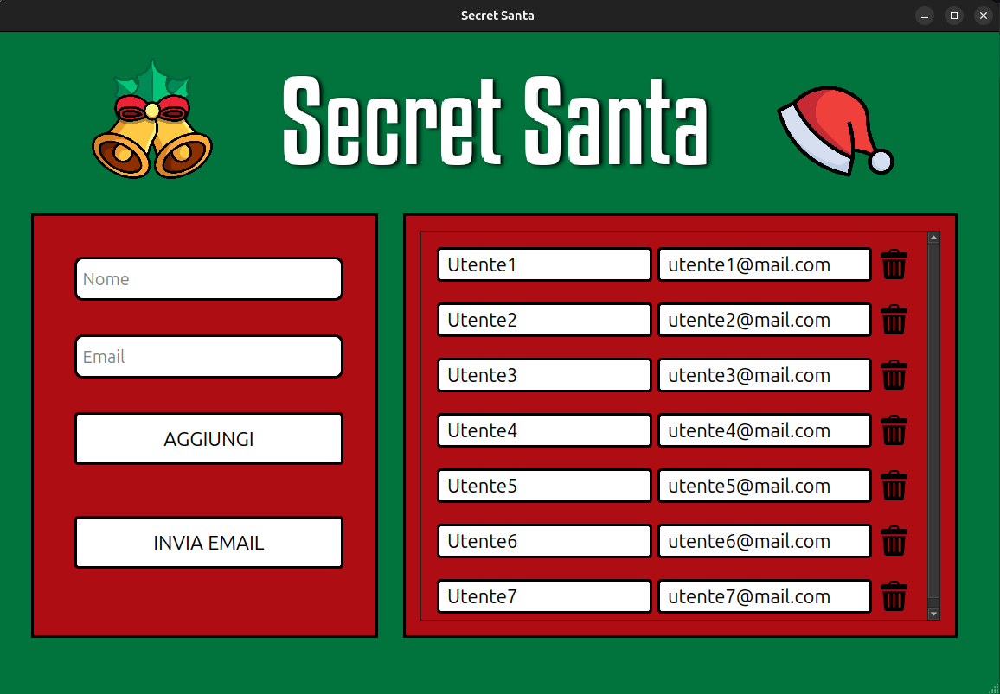

# SecretSanta
My first mini Qt project. Secret Santa is a Christmas game to play with a group of friends. To each person is randomly assigned a recipient to which he will have to give a Christmas gift. This application allows you to add game participants and then automatically create randomly the assignments and send emails to your friends in which reveal his recipient. 

# Technologies
- C++
- QtCreator
- Qt library
- smtpClient-for-qt

# UI

